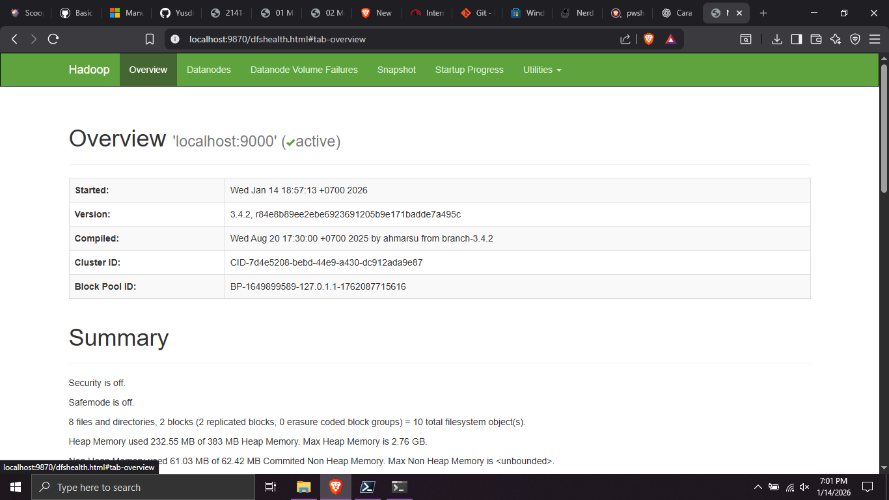
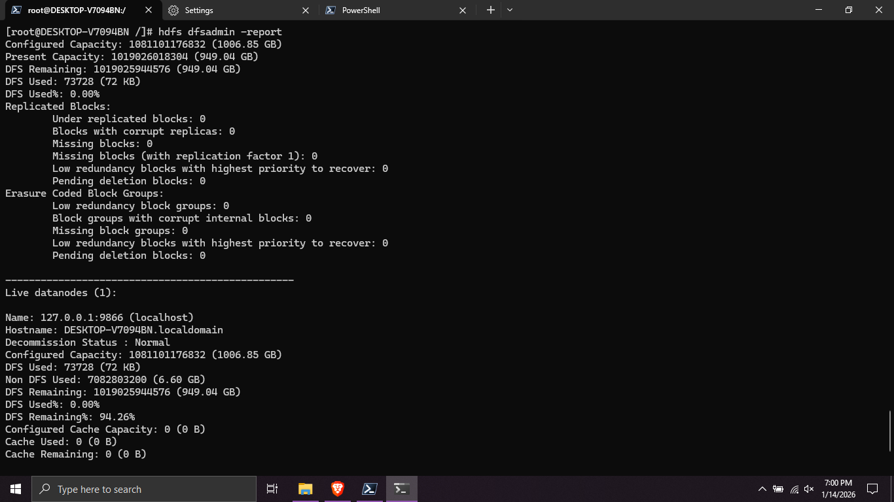
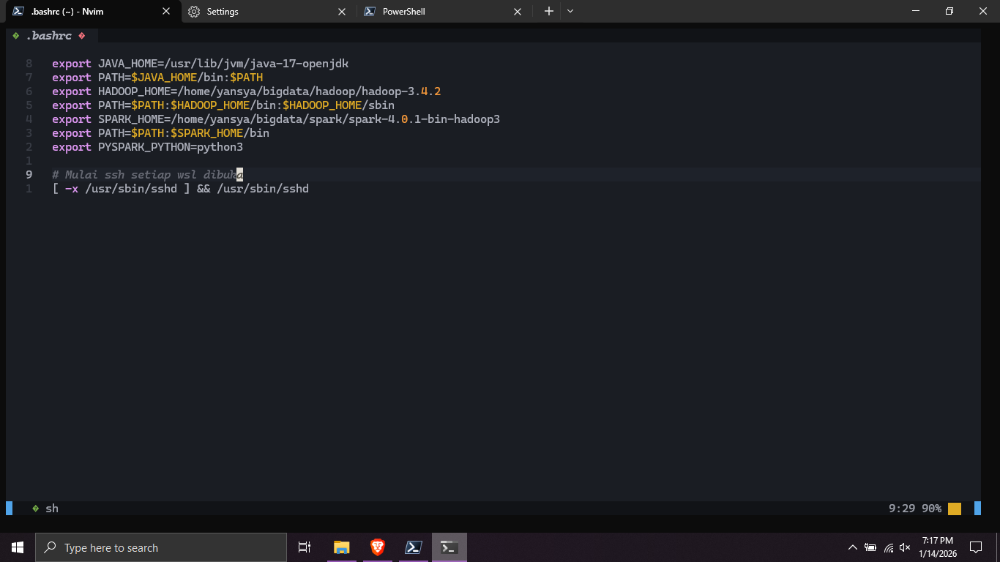
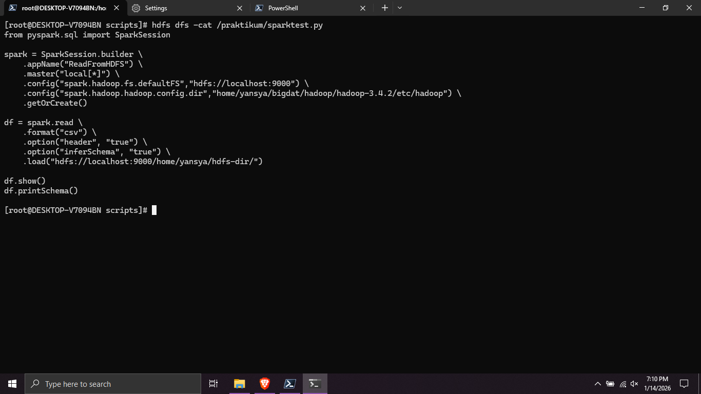

# TUGAS 1
## Installasi HDFS
Untuk melakukan installasi HDFS pertama download semua program yang dibutuhkan:
- Apache Hadoop
- WSl (jika di windows)
- SSH

### Langkah-langkah
1. Download dan Ekstrak File Hadoop ke WSL
2. Format NameNode untuk pertama kali dengan `hdfs namenode -format`
3. Jalankan HDFS dengan `start-dfs.sh`

4. Jalankan yarn dengan `start-yarn.sh`

5. Cek status dengan `jps` atau `hdfs dfsadmin -report`

6. Buat script agar command bisa dipakai di direktori apapun *opsional*

### Test HDFS
1. jalankan hdfs `start-dfs.sh`
2. buat direktori pada namenode `hdfs dfs -mkdir /praktikum`
3. taruh file kedalam hdfs `hdfs dfs -put *nama file* /praktikum`
4. tampilkan isi file dengan `hdfs dfs -cat *nama file* /praktikum`

