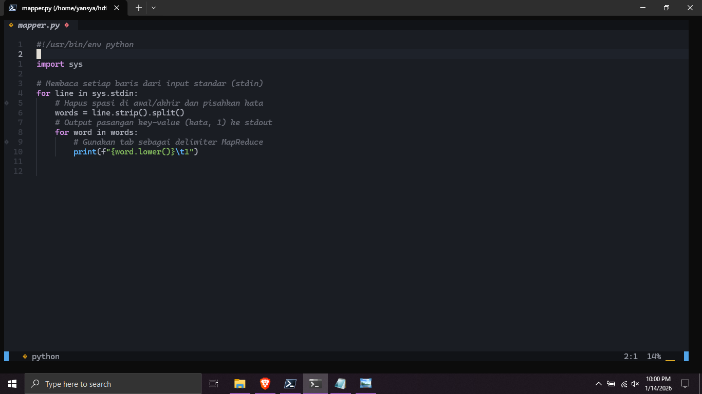
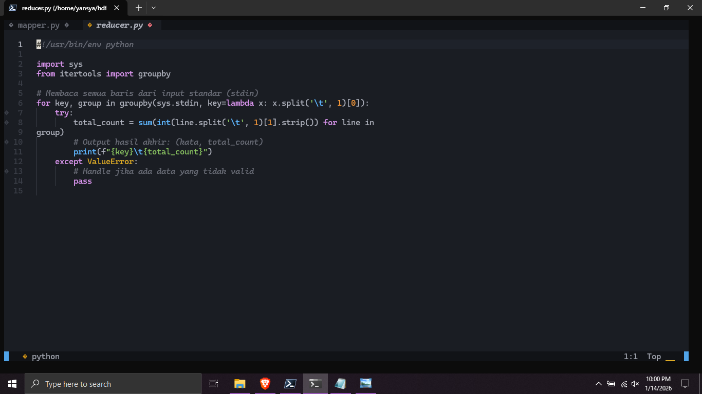
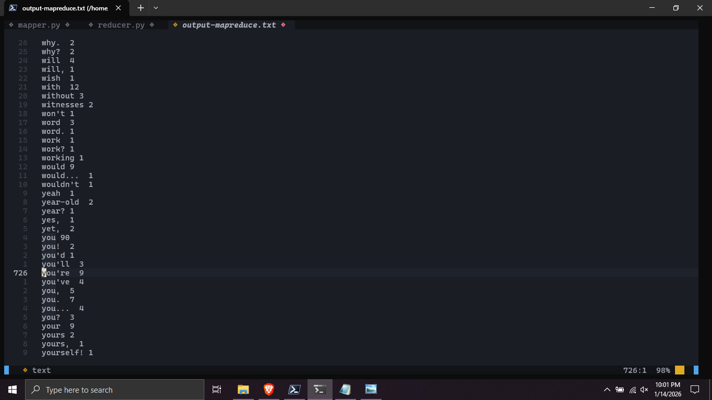
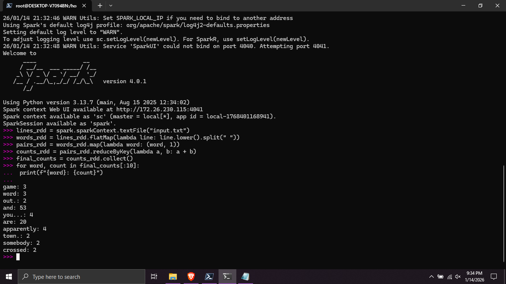
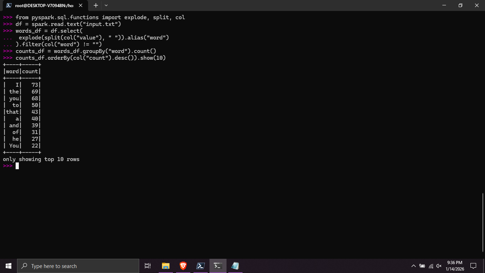

# Tugas 2  
## Pemrosesan Word Count

## Metode 1 MapReduce
1. buat direktori HDFS
2. isi direktori tadi dengan input.txt berisikan kata-kata
3. Buat mapper.py

4. buat reducer.py

5. Eksekusi program
`hadoop jar $HADOOP_HOME/share/hadoop/tools/lib/hadoop-streaming-*.jar \
-files mapper.py,reducer.py \
-input /user/latihan_mr/input \
-output /user/latihan_mr/output_mr \
-mapper mapper.py \
-reducer reducer.py`
6. Output Program

## Metode 2 Spark RDD
1. Install Apache Spark
2. jalankan spark shell dengan `pyspark`
3. Muat data dari hdfs dengan `lines_rdd = spark.sparkContext.textFile("input.txt")`
4. Pisahkan baris menjadi kata dengan flatmap `words_rdd = lines_rdd.flatMap(lambda line: line.lower().split(" "))`
5. buat pasangan kata `pairs_rdd = words_rdd.map(lambda word: (word, 1))`
6. Kurangi jumlah dengan menjumlahkan nilai berdasarkan key `counts_rdd = pairs_rdd.reduceByKey(lambda a, b: a + b)`
7. Ambil Hasil yang telah dihitung  `final_counts = counts_rdd.collect()`
8. Tampilkan 10 baris hasil `for word, count in final_counts[:10]: print(f"{word}: {count}")`

## Metode 3 Spark DataFrame
1. Masuk ke spark shell `pyspark`
2. import module yang diperlukan   `from pyspark.sql.functions import explode, split, col`
3. Jadikan input sebagai dataframe `df = spark.read.text("input.txt")`
4. Transformasi dataframe `s_df = df.select(
 explode(split(col("value"), " ")).alias("word")
).filter(col("word") != "") # Filter kata kosong
`
5. Gabungkan menjadi satu grup dan hitung `counts_df = words_df.groupBy("word").count()`
6. Tampilkan 10 hasil teratas `counts_df.orderBy(col("count").desc()).show(10) `

