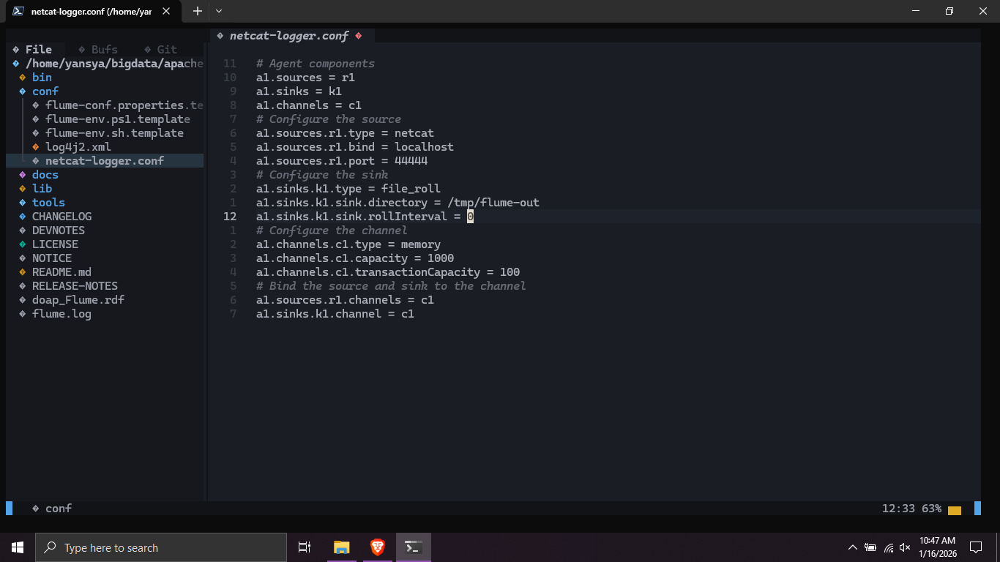
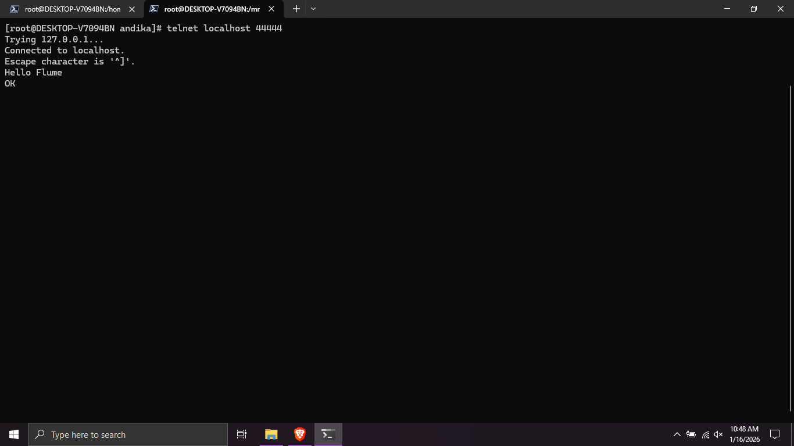

# Tugas 3

## Apache Flume
1. Download dan ekstrak apache flume
2. Masuk ke direktori `conf` dan buat file konfigurasi `netcat-logger.conf`

3. Jalankan dengan terminal `./bin/flume-ng agent --conf conf --conf-file conf/netcat-logger.conf --name a1 -Dflume.root.logger=INFO,console`
4. Buka terminal kedua dan lakukan `telnet localhost 44444`

5. Kirim pesan seperti "Hello Flume", jika berhasil akan ada output "OK"
6. Amati log di terminal pertama seharusnya akan muncul log seperti :  
12/01/26 15:32:19 INFO source.NetcatSource: Source starting  
12/01/26 15:32:19 INFO source.NetcatSource: Created serverSocket:sun.nio.ch.ServerSocketChannelImpl[/127.0.0.1:44444] 
12/01/26 15:32:34 INFO sink.LoggerSink: Event: { headers:{} body: 48 65 6C 6C 6F 20 77 6F 72 6C 64 21 0D          Hello Flume. }
